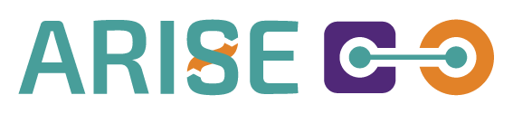

<p align="center">
  <picture>
    <source media="(prefers-color-scheme: dark)" srcset="images/ARISE_logo-dark_mode.png">
    <source media="(prefers-color-scheme: light)" srcset="images/ARISE_logo-light_mode.png">
    
  </picture>
</p>

<h1 align="center">ARISE Ergo — ROS2 Ergonomic Analysis Pipeline</h1>

A complete stack for real-time human ergonomic assessment using a RealSense camera, ROS2, FIWARE Orion-LD, CrateDB, and Grafana.

---

## About ARISE

ARISE aims towards making industrial HRI more accessible and cost-effective, in particular in healthcare, intra-logistics and manufacturing sectors. These modules hope to present an integration between FIWARE Orion Context Broker and eProsima Vulcanexus to enable context-aware robotic and industrial applications, alongside ROS4HRI as an open-source ROS standard and a set of ROS packages to facilitate the development of Human-Robot Interaction (HRI) capabilities on robots.

---

## Table of Contents

1. [Docker Setup](#1-docker-setup)
2. [ROS2 Workspace Setup](#2-ros2-workspace-setup)
3. [Launching the ROS2 Pipeline](#3-launching-the-ros2-pipeline)
4. [FIWARE Stack](#4-fiware-stack)
5. [NGSI-LD Subscription](#5-ngsi-ld-subscription)
6. [Verify Data in CrateDB](#6-verify-data-in-cratedb)
7. [Grafana Dashboard](#7-grafana-dashboard)
8. [Architecture Overview](#architecture-overview)

---

## 1. Docker Setup

> **Prerequisites**: an X11 session must be available on the host (this is a desktop/workstation setup, not a headless server) — `$DISPLAY` and `$HOME` are used by `docker-compose.yml` to forward the display into the container for GUI tools like RViz2. On a headless or SSH-only host, start the pipeline with `use_rviz:=false` (see [section 3](#3-launching-the-ros2-pipeline)) — otherwise the RViz2 node will fail with no clear error.

Fetch the ROS2 package submodules under `components/` (required before the first build — an empty `components/` tree will make later steps fail with confusing errors):

```bash
git submodule update --init --recursive
```

Copy `.env.example` to `.env` if you need to change `ROS_DOMAIN_ID` (default `26`) — it's the single source of truth read by both `docker-compose.yml` and the Dockerfile build, so it only needs to be set in one place.

Build the Docker image from scratch (no cache), then start the whole stack — both the ROS2 container and the FIWARE services (Orion-LD, CrateDB, QuantumLeap, Grafana) are defined in the same `docker-compose.yml`, so this one command brings up everything:

```bash
# Full rebuild without cache
docker compose build --no-cache

# Standard build (uses cache)
docker compose build

# Allow Docker to access the local display (needed for GUI tools like RViz2)
xhost +local:docker

# Start the container in detached mode
docker compose up -d

# Open an interactive shell inside the container
docker exec -it arise_ergo_dckr bash
```

---

## 2. ROS2 Workspace Setup

Inside the container, install dependencies and build the workspace:

```bash
# Update apt packages
apt update

# Update rosdep index
rosdep update

# Install all ROS dependencies declared in the workspace packages
rosdep install --from-paths src --ignore-src -y

# Build the workspace with symlink-install for faster iteration
colcon build --symlink-install

# Source the workspace overlay
source install/setup.bash
```

---

## 3. Launching the ROS2 Pipeline

The whole pipeline used to require one terminal per node (camera, body detection, RViz2 with 3 manual panel setup steps, the calculator nodes and the Orion bridge). It's now a single command, run inside the container:

```bash
ros2 launch /home/ros_user/catkin_ws/launch/arise_ergo.launch.py
```

This ([launch/arise_ergo.launch.py](launch/arise_ergo.launch.py)) starts, in order:

1. **RealSense camera** (`realsense2_camera`'s `rs_launch.py`) — publishes RGB/depth/pointcloud topics.
2. **Body tracking** (`hri_body_detect`'s `hri_body_detect_with_args.launch.py`) — detects skeleton keypoints from the camera stream.
3. **RViz2**, pre-loaded with [components/human_description/config/human.rviz](components/human_description/config/human.rviz) — no manual panel setup needed. Note the Fixed Frame is `body_default` (the actual published frame name; the pipeline just calls it "body" informally).
4. **`ergodata_calculator`** — computes joint angles (neck, trunk, arms, elbows, shoulders) and speed, publishing `/ergo_data`.
5. **`rula_calculator`** — runs the RULA (Rapid Upper Limb Assessment) scoring algorithm on `/ergo_data`, publishing `/rula_score`.
6. **`reba_calculator`** — runs the REBA (Rapid Entire Body Assessment) scoring algorithm on `/ergo_data`, publishing `/reba_score`.
7. **`ergo_alert`** — classifies `/rula_score` into alert levels and publishes `/ergo_alert` only when the level changes. Thresholds are node parameters (`warning_threshold`, default `5`; `critical_threshold`, default `7`).
8. **`orion_bridge`** — sends the `/ergo_data` fields to the FIWARE Orion-LD context broker as the NGSI-LD entity `urn:ngsi-ld:ErgoData:001`.

Launch arguments:

| Argument | Default | Effect |
|---|---|---|
| `use_rviz` | `true` | Set to `false` to skip RViz2 — required on headless hosts with no X11 session. |

```bash
# Headless run, no visualization
ros2 launch /home/ros_user/catkin_ws/launch/arise_ergo.launch.py use_rviz:=false
```

> **Optional debug check**: `ros2 topic echo /ergo_data` (or `/rula_score`, `/reba_score`, `/ergo_alert`) in a separate terminal to inspect the live data without affecting the running pipeline.

### Testing without a camera

[launch/arise_ergo_test.launch.py](launch/arise_ergo_test.launch.py) runs the same node chain with [launch/fake_body_publisher.py](launch/fake_body_publisher.py) in place of the RealSense camera and `hri_body_detect`. Use it to exercise the calculators, the alert node and the Orion bridge on a machine with no RealSense attached:

```bash
# Full chain, synthetic body, data all the way to Orion-LD
ros2 launch /home/ros_user/catkin_ws/launch/arise_ergo_test.launch.py

# ROS2 side only, no FIWARE stack needed
ros2 launch /home/ros_user/catkin_ws/launch/arise_ergo_test.launch.py use_orion:=false

# Watch the synthetic skeleton in RViz2
ros2 launch /home/ros_user/catkin_ws/launch/arise_ergo_test.launch.py use_rviz:=true
```

The fixture broadcasts the 15 `*_default` tf frames the calculator looks up, cycling through six postures (6s each, `posture_duration` parameter) chosen to cross the alert thresholds. The joint angles it produces are exact by construction, which makes it usable as a regression check:

| Posture | `trunk_angle` | `left_arm_angle` | `left_elbow_angle` | `speed` | RULA | REBA |
|---|---|---|---|---|---|---|
| neutral standing | 0 | 180 | 5 | 0 | 2 | 1 |
| arms forward 60° | 0 | 120 | 30 | 0 | 3 | 2 |
| arms overhead | 0 | 20 | 20 | 0 | 3 | 3 |
| trunk bent 45° | 45 | 140 | 60 | 0 | **6** | 4 |
| trunk twisted | 20 | 130 | 45 | 0 | 4 | 3 |
| walking in place | 5 | 160 | 25 | 7–18 | 2 | 1 |

Note the pipeline's convention: `left_arm_angle` is the angle between the upper arm and the spine, so **180° means the arm hangs at rest** and small values mean it is raised overhead. `trunk bent 45°` is the posture that pushes RULA to 6 and makes `ergo_alert` publish its `warning` level, so it is the one to watch when checking that the alert path works.

Because the fixture needs neither the camera nor RViz2, only two workspace packages have to be built for it:

```bash
colcon build --symlink-install --packages-select jntlb_fwk_msgs ergo_pkg_py
```

---

## 4. FIWARE Stack

Nothing to do here — the FIWARE stack (Orion-LD, CrateDB, QuantumLeap, Grafana) was already started by `docker compose up -d` in [section 1](#1-docker-setup), since all services live in this repo's own `docker-compose.yml`.

---

## 5. NGSI-LD Subscription

Create a subscription so Orion-LD notifies the QuantumLeap/CrateDB sink whenever `ErgoData` entities are updated:

```bash
curl -X POST http://localhost:1026/ngsi-ld/v1/subscriptions \
  -H "Content-Type: application/ld+json" \
  -d '{
    "id": "urn:ngsi-ld:Subscription:ErgoData",
    "type": "Subscription",
    "entities": [{"type": "ErgoData"}],
    "notification": {
      "endpoint": {
        "uri": "http://127.0.0.1:8668/v2/notify",
        "accept": "application/json"
      }
    },
    "@context": ["https://uri.etsi.org/ngsi-ld/v1/ngsi-ld-core-context.jsonld"]
  }'
```

---

## 6. Verify Data in CrateDB

> **Note:** The table is named `etergodata` (not `mtergodata`).

Query the most recent 3 records to confirm data is flowing:

```bash
curl -s "http://localhost:4200/_sql" \
  -H "Content-Type: application/json" \
  -d '{"stmt": "SELECT * FROM etergodata ORDER BY time_index DESC LIMIT 3"}' \
  | python3 -m json.tool
```

---

## 7. Grafana Dashboard

The CrateDB data source (uid `cratedb`) and the `AriseDashboard` dashboard are both auto-provisioned (see `conf/grafana/datasources/datasource.yaml` and `conf/grafana/dashboards/AriseDashboard.json`, mounted in `docker-compose.yml`) — no manual setup needed.

Open [http://localhost:3000](http://localhost:3000), log in with `admin` / `admin`, and open **AriseDashboard** from the dashboard list. Set the time range in the top-right corner to match your recording session (the dashboard defaults to the last 15 minutes, auto-refreshing every 5s).

Every panel reads the `etergodata` table from [section 6](#6-verify-data-in-cratedb):

| Panel | Shows |
|---|---|
| Neck / Trunk / Left arm / Right arm | latest value of each, as a headline number |
| **Neck**, **Trunk** | flexion, frontal/bending and twisting angles over time |
| **Upper arms**, **Elbows**, **Wrists**, **Shoulders** | left vs right over time (left is always blue, right always orange) |
| **Movement speed**, **External load** | the two non-angle fields |
| **Latest samples** | the last 100 raw rows as a table |

> **Note**: pressing **Save & test** on the CrateDB data source reports an error — CrateDB's SQL parser rejects the probe statement Grafana sends. It is cosmetic: the panel queries themselves work (verified through Grafana's query API against a live `etergodata` table).

> **Not in CrateDB yet**: `orion_bridge` forwards only the `/ergo_data` fields, so the RULA/REBA scores and the ergonomic alerts stay inside ROS2 and cannot be charted here. To chart them, the bridge would have to publish `/rula_score`, `/reba_score` and `/ergo_alert` to Orion-LD as well.

---

## Architecture Overview

```
RealSense Camera
      │
      ▼
realsense2_camera (ROS2)
      │
      ▼
hri_body_detect  ──►  RViz2 (visualization)
      │  tf: *_default frames rel. to body_default
      ▼
ergodata_calculator
      │  /ergo_data
      ├──────────────┬──────────────┐
      ▼              ▼              ▼
rula_calculator  reba_calculator  orion_bridge
      │  /rula_score   │  /reba_score  │
      ▼                               ▼
 ergo_alert                    Orion-LD (FIWARE)
      │  /ergo_alert                  │  NGSI-LD Subscription
      ▼                               ▼
 (ROS2 consumers)          QuantumLeap ──► CrateDB ──► Grafana
```

---

<p align="center">
  <picture>
    <source media="(prefers-color-scheme: dark)" srcset="images/EN_Co_fundedbytheEU_RGB_NEG.png">
    <source media="(prefers-color-scheme: light)" srcset="images/EN_Co_fundedbytheEU_RGB_Monochrome.png">
    
  </picture>
</p>

<p align="center"><sub>
Funded by the European Union. Views and opinions expressed are however those of the author(s) only and do not necessarily reflect those of the European Union or HADEA. Neither the European Union nor the granting authority can be held responsible for them.
</sub></p>