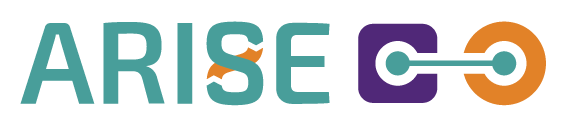

<p align="center">
  <picture>
    <source media="(prefers-color-scheme: dark)" srcset="images/ARISE_logo-dark_mode.png">
    <source media="(prefers-color-scheme: light)" srcset="images/ARISE_logo-light_mode.png">
    
  </picture>
</p>

<h1 align="center">ARISE Ergo — ROS2 Ergonomic Analysis Pipeline</h1>

A complete stack for real-time human ergonomic assessment using a RealSense camera, ROS2, FIWARE Orion-LD, CrateDB, and Grafana.

---

## About ARISE

ARISE aims towards making industrial HRI more accessible and cost-effective, in particular in healthcare, intra-logistics and manufacturing sectors. These modules hope to present an integration between FIWARE Orion Context Broker and eProsima Vulcanexus to enable context-aware robotic and industrial applications, alongside ROS4HRI as an open-source ROS standard and a set of ROS packages to facilitate the development of Human-Robot Interaction (HRI) capabilities on robots.

---

## Table of Contents

1. [Docker Setup](#1-docker-setup)
2. [ROS2 Workspace Setup](#2-ros2-workspace-setup)
3. [Launching the ROS2 Pipeline](#3-launching-the-ros2-pipeline)
4. [FIWARE Stack](#4-fiware-stack)
5. [NGSI-LD Subscription](#5-ngsi-ld-subscription)
6. [Verify Data in CrateDB](#6-verify-data-in-cratedb)
7. [Grafana Dashboard](#7-grafana-dashboard)
8. [Architecture Overview](#architecture-overview)

What changed on the `feature/ros4hri-ergo-advisor` branch, why, how it was checked and the known limitations: [docs/BRANCH_NOTES.md](docs/BRANCH_NOTES.md).

---

## 1. Docker Setup

> **Prerequisites**: an X11 session must be available on the host (this is a desktop/workstation setup, not a headless server) — `$DISPLAY` and `$HOME` are used by `docker-compose.yml` to forward the display into the container for GUI tools like RViz2. On a headless or SSH-only host, start the pipeline with `use_rviz:=false` (see [section 3](#3-launching-the-ros2-pipeline)) — otherwise the RViz2 node will fail with no clear error.

Fetch the ROS2 package submodules under `components/` (required before the first build — an empty `components/` tree will make later steps fail with confusing errors):

```bash
git submodule update --init --recursive
```

Copy `.env.example` to `.env` if you need to change `ROS_DOMAIN_ID` (default `26`) — it's the single source of truth read by both `docker-compose.yml` and the Dockerfile build, so it only needs to be set in one place.

Build the Docker image from scratch (no cache), then start the whole stack — both the ROS2 container and the FIWARE services (Orion-LD, CrateDB, QuantumLeap, Grafana) are defined in the same `docker-compose.yml`, so this one command brings up everything:

```bash
# Full rebuild without cache
docker compose build --no-cache

# Standard build (uses cache)
docker compose build

# Allow Docker to access the local display (needed for GUI tools like RViz2)
xhost +local:docker

# Start the container in detached mode
docker compose up -d

# Open an interactive shell inside the container
docker exec -it arise_ergo_dckr bash
```

---

## 2. ROS2 Workspace Setup

Inside the container, install dependencies and build the workspace:

```bash
# Update apt packages
apt update

# Update rosdep index
rosdep update

# Install all ROS dependencies declared in the workspace packages
rosdep install --from-paths src --ignore-src -y

# Build the workspace with symlink-install for faster iteration
colcon build --symlink-install

# Source the workspace overlay
source install/setup.bash
```

---

## 3. Launching the ROS2 Pipeline

The whole pipeline used to require one terminal per node (camera, body detection, RViz2 with 3 manual panel setup steps, the calculator nodes and the Orion bridge). It's now a single command, run inside the container:

```bash
ros2 launch /home/ros_user/catkin_ws/launch/arise_ergo.launch.py
```

This ([launch/arise_ergo.launch.py](launch/arise_ergo.launch.py)) starts, in order:

1. **RealSense camera** (`realsense2_camera`'s `rs_launch.py`) — publishes RGB/depth/pointcloud topics.
2. **Body tracking** (`hri_body_detect`, upstream [ros4hri/hri_body_detect](https://github.com/ros4hri/hri_body_detect) 3.4.1, started as a lifecycle node by this launch file with `use_depth: true`; the RealSense driver runs with `align_depth.enable` so the depth is registered on the colour image) — detects up to five people with MediaPipe and a tracker, and publishes each one under a random body id, `/humans/bodies/<id>/`. It needs `hri_msgs` ≥ 2.3, which the image does not ship: it is the `components/hri_msgs` submodule, built from source in the workspace.
3. **RViz2**, pre-loaded with [launch/human_ros4hri.rviz](launch/human_ros4hri.rviz) — Fixed Frame `camera_link`, the `hri_rviz` `Humans` (2D overlay on the camera image), `Skeletons3D` and `TF_HRI` displays, which follow whatever bodies are tracked. The `human.rviz` of `human_description` is written for the single id `default` (frames `*_default`, Fixed Frame `body_default`) and shows nothing with real ids.
4. **`ergodata_calculator`** — computes joint angles (neck, trunk, arms, elbows, shoulders) and speed, publishing `ergo_data`.
5. **`rula_calculator`** — runs the RULA (Rapid Upper Limb Assessment) scoring algorithm on `ergo_data`, publishing `rula_score`.
6. **`reba_calculator`** — runs the REBA (Rapid Entire Body Assessment) scoring algorithm on `ergo_data`, publishing `reba_score`.
7. **`ergo_alert`** — classifies `rula_score` into alert levels and publishes `ergo_alert` only when the level changes. Thresholds are node parameters (`warning_threshold`, default `5`; `critical_threshold`, default `7`).
8. **`orion_bridge`** — sends the `ergo_data` fields, the latest RULA/REBA partial scores (`rula_*`, `reba_*`) and the alert state (`alert_level`, `alert_description`) to the FIWARE Orion-LD context broker, one NGSI-LD entity per body: `urn:ngsi-ld:ErgoData:<body_id>`. The scores are merged into each `ergo_data` sample, so a score can be at most one calculation cycle older than the angles next to it.

Every ergonomic topic is per person, following the ROS4HRI conventions — see [ROS4HRI conventions](#ros4hri-conventions).

Launch arguments:

| Argument | Default | Effect |
|---|---|---|
| `use_rviz` | `true` | Set to `false` to skip RViz2 — required on headless hosts with no X11 session. |
| `use_camera` | `true` | Set to `false` to skip the RealSense driver and feed the detector from something else (a rosbag, or a video republished on `/camera/camera/color/image_raw`, `.../color/camera_info`, `/camera/camera/aligned_depth_to_color/image_raw` and `.../aligned_depth_to_color/camera_info`). |
| `use_orion` | `true` | Set to `false` to skip `orion_bridge`, so a test does not write to Orion-LD. |
| `use_llm` | `false` | Set to `true` to start `ergo_advisor` (see [Local LLM advisor](#local-llm-advisor-optional)). |

```bash
# Headless run, no visualization
ros2 launch /home/ros_user/catkin_ws/launch/arise_ergo.launch.py use_rviz:=false
```

> **Optional debug check**: `ros2 topic echo /humans/bodies/tracked` lists the body ids currently tracked; then `ros2 topic echo /humans/bodies/<id>/ergo_data` (or `rula_score`, `reba_score`, `ergo_alert`) in a separate terminal inspects the live data of one person without affecting the running pipeline. Ids are random and change when the tracker loses someone and finds them again.

### ROS4HRI conventions

The pipeline follows [ROS4HRI (REP-155)](https://www.ros.org/reps/rep-0155.html), the HRI standard used across ARISE:

- **From the standard** (as produced by `hri_body_detect`): body ids are listed on `/humans/bodies/tracked` (`hri_msgs/IdsList`); each body has a root tf frame `body_<body_id>` and one frame per URDF link, `<link>_<body_id>`.
- **Our extension**: ROS4HRI defines no ergonomic messages, so they are defined in the [`hri_ergonomics_msgs`](components/hri_ergonomics_msgs) package of this repository, and the ergonomic topics live in the body namespace, next to the standard sub-topics (`skeleton2d`, `joint_states`, `roi`, …):

| Topic | Type | Publisher |
|---|---|---|
| `/humans/bodies/<body_id>/ergo_data` | `hri_ergonomics_msgs/ErgoData` | `ergodata_calculator` (10 Hz) |
| `/humans/bodies/<body_id>/rula_score` | `hri_ergonomics_msgs/RULAScore` | `rula_calculator` |
| `/humans/bodies/<body_id>/reba_score` | `hri_ergonomics_msgs/RebaScore` | `reba_calculator` |
| `/humans/bodies/<body_id>/ergo_alert` | `hri_ergonomics_msgs/ErgoAlert` | `ergo_alert` (on level change) |
| `/humans/bodies/<body_id>/ergo_advice` | `hri_ergonomics_msgs/ErgoAdvice` | `ergo_advisor` (optional) |

Like the ROS4HRI messages, every ergonomic message starts with a `std_msgs/Header`: `frame_id` is the body root frame (`body_<body_id>`) and `stamp` is the time of the skeleton sample it was computed from — `ergodata_calculator` sets it from tf and every downstream node copies it, so a score or alert can be matched to the exact posture that produced it.

`speed` is how far `body_<body_id>` moved in the horizontal plane of a fixed frame since the previous cycle (mm per 0.1 s cycle). The body frame follows the person, so the fixed frame is a parameter of `ergodata_calculator`, `reference_frame` (default `camera_link`, which `hri_body_detect`'s camera frame hangs from); if that frame is not available, `speed` is 0 and the rest of the sample is still published.

Every node follows `/humans/bodies/tracked` and creates or removes the per-body publishers and subscriptions as people come and go (a body is dropped after 2 s of absence, so a missed detection does not cause churn). Several people are therefore handled at once. A new id is acted upon only after it has been tracked for `body_min_age` seconds (parameter of every ergonomic node, default `1.0`; `0` reacts at first sight): a tracker can emit ids that live for a fraction of a second, and without the filter each one would create topics and an Orion entity for a person that was never there. On a test clip with two people walking, it cut the bodies created in 40 s from 21 to 10. The fixture's bodies therefore appear one second after launch. Upstream `hri_body_detect` follows several people at once, each under its own random id (the JOiiNT fork this project used before forced every track to `default`, so only one person could be followed). Its ids are not stable: on short test clips the tracker lost and re-created a person every few seconds, so in a real shift expect a new entity whenever someone leaves the view and returns. The test fixture can simulate several people (`body_ids` below).

`orion_bridge` also subscribes to `rula_score`, `reba_score` and `ergo_alert` of every body, to mirror them into Orion-LD next to the angles. Body ids are transient tracks. Moving the topics to the person namespace (`/humans/persons/<person_id>/`, stable identity across a shift) would require a person manager such as `hri_person_manager` in the pipeline.

### Local LLM advisor (optional)

`ergo_advisor` turns each `ergo_alert` WARNING/CRITICAL event of a body into a short explanation and a corrective recommendation, published on `/humans/bodies/<body_id>/ergo_advice` (`hri_ergonomics_msgs/ErgoAdvice`). It picks the RULA partial scores that push the score up (e.g. trunk 4/6) and asks a local LLM served by [Ollama](https://ollama.com) to phrase them — nothing leaves the machine.

The LLM never computes or changes the scores: RULA/REBA stay deterministic. If the model is not running, times out or returns an unusable answer, the node publishes a template text instead (`generated_by_llm: false`), so the topic keeps working without the LLM.

```bash
# On the host: start the optional ollama service and pull a model once
docker compose --profile llm up -d
docker exec ollama ollama pull qwen2.5:7b-instruct

# Inside the container
ros2 launch /home/ros_user/catkin_ws/launch/arise_ergo.launch.py use_llm:=true
ros2 topic echo /humans/bodies/<id>/ergo_advice   # <id> from /humans/bodies/tracked
```

Node parameters: `llm_url` (default `http://127.0.0.1:11434`), `model` (`qwen2.5:7b-instruct`), `timeout_s` (`20.0`), `language` (`en` or `it`). A 7B model runs on CPU with a few seconds of latency per alert; uncomment the `deploy` block of the `ollama` service in `docker-compose.yml` to use an NVIDIA GPU.

### Testing without a camera

[launch/arise_ergo_test.launch.py](launch/arise_ergo_test.launch.py) runs the same node chain with [launch/fake_body_publisher.py](launch/fake_body_publisher.py) in place of the RealSense camera and `hri_body_detect`. Use it to exercise the calculators, the alert node and the Orion bridge on a machine with no RealSense attached:

```bash
# Full chain, synthetic body, data all the way to Orion-LD
ros2 launch /home/ros_user/catkin_ws/launch/arise_ergo_test.launch.py

# ROS2 side only, no FIWARE stack needed
ros2 launch /home/ros_user/catkin_ws/launch/arise_ergo_test.launch.py use_orion:=false

# Watch the synthetic skeleton frames in RViz2 (TF_HRI display; Skeletons3D needs the URDF of the real detector)
ros2 launch /home/ros_user/catkin_ws/launch/arise_ergo_test.launch.py use_rviz:=true

# Three simulated people, each one posture ahead of the previous
ros2 launch /home/ros_user/catkin_ws/launch/arise_ergo_test.launch.py "body_ids:=['a', 'b', 'c']"
```

The fixture publishes the body ids on `/humans/bodies/tracked` and, for each body, the 15 `<link>_<body_id>` tf frames the calculator looks up, cycling through six postures (6s each, `posture_duration` parameter) chosen to cross the alert thresholds. As in REP-155, each `body_<body_id>` frame has its origin between the hips and is parented to the camera frame (`camera_link`), 2.5 m in front of it; walking in place moves the body frame itself, like a real tracker. The joint angles it produces are exact by construction, and every angle is kept a few degrees away from the RULA/REBA band limits, so the scores below are a reliable regression check:

| Posture | `trunk_angle` | `left_arm_angle` | `left_elbow_angle` | `neck_angle` | `speed` | RULA | REBA |
|---|---|---|---|---|---|---|---|
| neutral standing | 0 | 180 | 5 | 5 | 0 | 2 | 1 |
| arms forward 60° | 0 | 120 | 30 | 5 | 0 | 3 | 2 |
| arms overhead | 0 | 20 | 20 | 5 | 0 | 3 | 3 |
| bent 70° reaching | 70 | 70 | 50 | 5 | 0 | **5** | 5 |
| trunk twisted | 25 | 130 | 45 | 5 | 0 | 4 | 4 |
| walking in place | 10 | 170 | 25 | 5 | up to ~19 | 2 | 2 |

Note the pipeline's convention: `left_arm_angle` is the angle between the upper arm and the spine, so **180° means the arm hangs at rest** and small values mean it is raised overhead. `bent 70° reaching` (trunk flexed 70°, arm reaching forward) is the posture that pushes RULA to 5 and makes `ergo_alert` publish its `warning` level, so it is the one to watch when checking that the alert path works.

> An earlier version of this fixture had a neck angle of exactly 0° and several angles exactly on band limits (trunk 20°, elbow 60°…). RULA/REBA read a negative neck angle as extension, so floating-point noise decided the scores — the "RULA 6" once documented for a 45° trunk bend came from that noise, not from the posture.

Because the fixture needs neither the camera nor RViz2, only two workspace packages have to be built for it:

```bash
colcon build --symlink-install --packages-select hri_ergonomics_msgs ergo_pkg_py
```

---

## 4. FIWARE Stack

Nothing to do here — the FIWARE stack (Orion-LD, CrateDB, QuantumLeap, Grafana) was already started by `docker compose up -d` in [section 1](#1-docker-setup), since all services live in this repo's own `docker-compose.yml`.

---

## 5. NGSI-LD Subscription

The subscription that makes Orion-LD notify the QuantumLeap/CrateDB sink whenever an `ErgoData` entity is updated is created **automatically** when QuantumLeap starts: [build/quantumleap/inject.sh](build/quantumleap/inject.sh) waits for CrateDB and Orion-LD and then posts every `.json` file found in [conf/quantumleap/subscriptions/](conf/quantumleap/subscriptions/) (mounted into the container; the current one is [ergodata.json](conf/quantumleap/subscriptions/ergodata.json)). It is safe to restart: the subscription is stored in MongoDB, so on later starts Orion answers `409 Conflict` and the script reports "already exists".

To forward another entity type to CrateDB, drop one more `.json` file in that folder (add `receiverInfo` with a `fiware-service` key if the entity lives in a tenant). Because `inject.sh` is copied into the image, rebuild after editing it:

```bash
docker compose build quantumleap && docker compose up -d quantumleap
```

Check that it was created:

```bash
curl -s http://localhost:1026/ngsi-ld/v1/subscriptions | python3 -m json.tool
```

---

## 6. Verify Data in CrateDB

Query the most recent 3 records to confirm data is flowing (the table is named `etergodata`):

```bash
curl -s "http://localhost:4200/_sql" \
  -H "Content-Type: application/json" \
  -d '{"stmt": "SELECT * FROM etergodata ORDER BY time_index DESC LIMIT 3"}' \
  | python3 -m json.tool
```

---

## 7. Grafana Dashboard

The CrateDB data source (uid `cratedb`) and the `AriseDashboard` dashboard are both auto-provisioned (see `conf/grafana/datasources/datasource.yaml` and `conf/grafana/dashboards/AriseDashboard.json`, mounted in `docker-compose.yml`) — no manual setup needed.

Open [http://localhost:3000](http://localhost:3000), log in with `admin` / `admin`, and open **AriseDashboard** from the dashboard list. Set the time range in the top-right corner to match your recording session (the dashboard defaults to the last 15 minutes, auto-refreshing every 5s).

Every panel reads the `etergodata` table from [section 6](#6-verify-data-in-cratedb):

| Panel | Shows |
|---|---|
| **RULA**, **REBA**, **Alert** (latest) | latest score and alert level, coloured by action level |
| **Time at RULA >= 5** | share of the selected time range spent at or above the `ergo_alert` warning threshold |
| **RULA / REBA score**, **Alert level** | the two scores over time and a timeline of OK / Warning / Critical |
| Neck / Trunk / Left arm / Right arm | latest value of each, as a headline number |
| **Neck**, **Trunk** | flexion, frontal/bending and twisting angles over time |
| **Upper arms**, **Elbows**, **Wrists**, **Shoulders** | left vs right over time (left is always blue, right always orange) |
| **Movement speed**, **External load** | the two non-angle fields |
| **Latest samples** | the last 100 raw rows as a table |

> **Note**: pressing **Save & test** on the CrateDB data source reports an error — CrateDB's SQL parser rejects the probe statement Grafana sends. It is cosmetic: the panel queries themselves work (verified through Grafana's query API against a live `etergodata` table).

> **One entity per body**: each tracked body is a separate NGSI-LD entity (`urn:ngsi-ld:ErgoData:<body_id>`), i.e. a separate `entity_id` in `etergodata`. Pick it with the **Body** selector at the top of the dashboard; every panel is filtered on it.

> **Scores and alerts in CrateDB**: next to the angles, `etergodata` has one column per RULA/REBA partial score (`rula_full`, `rula_trunk`, `rula_left_upper_arm`, `reba_full`, ...) and the alert state (`alert_level`: 0 OK, 1 warning, 2 critical; `alert_description`). QuantumLeap adds the columns on its own the first time Orion sends them, so rows written before that have them empty. The advisor texts (`ergo_advice`) are still ROS2-only.

---

## Architecture Overview

```
RealSense Camera
      │
      ▼
realsense2_camera (ROS2)
      │
      ▼
hri_body_detect  ──►  RViz2 (visualization)
      │  /humans/bodies/tracked + tf: <link>_<id> frames rel. to body_<id>
      ▼
ergodata_calculator          (all topics below are per body:
      │  ergo_data            /humans/bodies/<id>/...)
      ├──────────────┬──────────────┐
      ▼              ▼              ▼
rula_calculator  reba_calculator  orion_bridge
      │  rula_score    │  reba_score   │
      ▼                               ▼
 ergo_alert                    Orion-LD (FIWARE)
      │  ergo_alert                   │  NGSI-LD Subscription
      ▼                               ▼
 ergo_advisor ◄── Ollama   QuantumLeap ──► CrateDB ──► Grafana
      │  ergo_advice  (optional, use_llm:=true)
      ▼
 (ROS2 consumers)
```

---

<p align="center">
  <picture>
    <source media="(prefers-color-scheme: dark)" srcset="images/EN_Co_fundedbytheEU_RGB_NEG.png">
    <source media="(prefers-color-scheme: light)" srcset="images/EN_Co_fundedbytheEU_RGB_Monochrome.png">
    
  </picture>
</p>

<p align="center"><sub>
Funded by the European Union. Views and opinions expressed are however those of the author(s) only and do not necessarily reflect those of the European Union or HADEA. Neither the European Union nor the granting authority can be held responsible for them.
</sub></p>